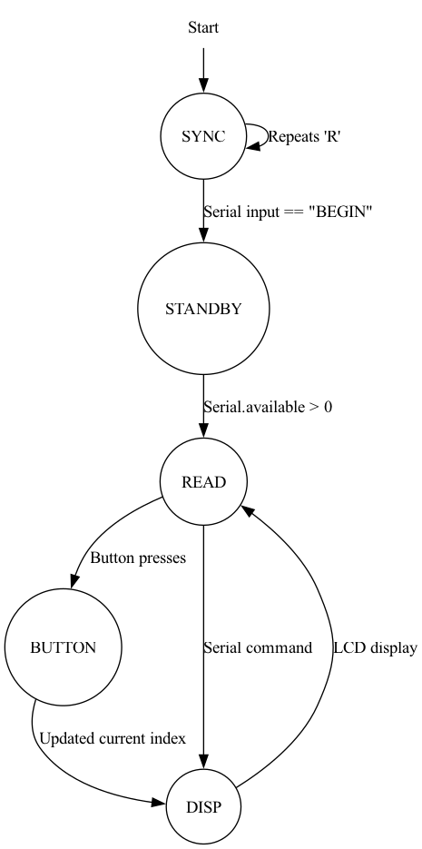

# 💼 Arduino Payroll Management System

## 📖 Overview

The **Payroll Management System** is an embedded application developed for the Arduino platform using the **Adafruit RGB LCD Shield**. It implements a Finite State Machine (FSM) to manage employee records, allowing for real-time data entry, validation, and display.

The system features a robust serial interface for data management and an interactive LCD dashboard for browsing employee records.

## ✨ Key Features

### 🛠 System Functions

* **Employee Management:** Add, update, and delete employee records via Serial Monitor.

* **Data Validation:** Strict input validation for IDs (7-digit), Grades (1-9), Salaries, and Job Titles.

* **Automatic Sorting:** Uses Bubble Sort to keep records ordered by Employee ID.

* **Memory Optimization:** Dynamic monitoring of Free SRAM.

### 🖥 LCD Interface

* **Interactive Dashboard:** Scroll through employee lists using UP/DOWN buttons.

* **Status Indicators:**

  * **Green Backlight:** Employee has a Pension.

  * **Red Backlight:** Employee has No Pension.

  * **Purple Backlight:** Memory/Info check (Hold Select).

* **Custom Graphics:** Custom-designed up/down arrows for navigation indicators.

### ⚙️ Finite State Machine (FSM)

The system operates on a 5-state architecture: 

1. **SYNC:** Handshake state (sends 'R' until "BEGIN" is received).

2. **STANDBY:** Idle state waiting for input.

3. **READ:** Processes Serial inputs or button presses.

4. **BUTTON:** Handles scrolling and info display logic.

5. **DISP:** Updates the LCD screen.

**

## 🔌 Hardware & Software Requirements

### Hardware

* Arduino Board (Uno/Mega/Leonardo).

* Adafruit RGB LCD Shield (w/ MCP23017).

### Software Dependencies

You need the following libraries installed in your Arduino IDE:

* `Wire.h` (Built-in)

* `Adafruit_RGBLCDShield.h`

* `Adafruit_MCP23017.h`

* `MemoryFree.h` (For SRAM monitoring)

## 🚀 Installation & Setup

1. **Install Libraries:**

   * Go to **Sketch > Include Library > Manage Libraries**.

   * Search for "Adafruit RGB LCD Shield" and install it.

   * Download and install the `MemoryFree` library manually if not found in the manager.

2. **Upload Code:**

   * Open `Payroll Management System.ino`.

   * Connect your Arduino.

   * Select your board and port.

   * Click **Upload**.

3. **Start the System:**

   * Open the **Serial Monitor** (Baud Rate: **9600**).

   * The system will print `R` repeatedly.

   * Type `BEGIN` and press Enter to initialize the system.

## 🕹 Usage Guide

### Serial Commands

The system accepts the following commands in specific formats. All fields are separated by hyphens (`-`).

| Command | Syntax | Description | 
 | ----- | ----- | ----- | 
| **Add Employee** | `ADD-ID-Grade-Title` | Adds a new user (e.g., `ADD-1234567-5-Engineer`). | 
| **Update Pension** | `PST-ID-Status` | Set pension to `PEN` or `NPEN` (e.g., `PST-1234567-PEN`). | 
| **Update Grade** | `GRD-ID-Grade` | Upgrades rank (e.g., `GRD-1234567-6`). | 
| **Update Salary** | `SAL-ID-Salary` | Updates salary (e.g., `SAL-1234567-45000.50`). | 
| **Update Title** | `CJT-ID-Title` | Changes job title (e.g., `CJT-1234567-Manager`). | 
| **Delete Employee** | `DEL-ID` | Removes an employee from the system. | 

### LCD Button Controls

| Button | Action | 
 | ----- | ----- | 
| **UP** | Scroll to the previous employee. | 
| **DOWN** | Scroll to the next employee. | 
| **SELECT** | **Hold** to view System Info (Student ID & Free SRAM). | 

## 🐞 Debugging

The code includes a debug mode. To enable detailed serial logging:

1. Open the source code.

2. Ensure `#define DEBUG` is uncommented at the top of the file.

3. Re-upload to see detailed logs like:
   `DEBUG: Updated Grade for ID 1234567: 6 DONE!`

## 📂 Project Structure

* `Payroll Management System.ino`: Main application code.

* `fsm.dot` / `fsm.png`: Documentation of the state machine logic.
